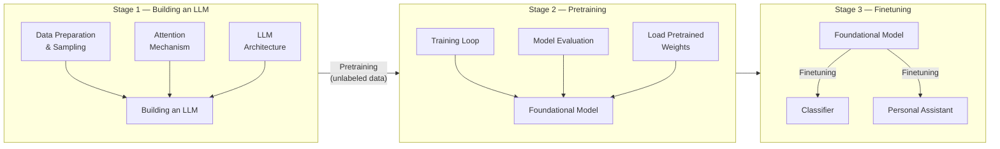
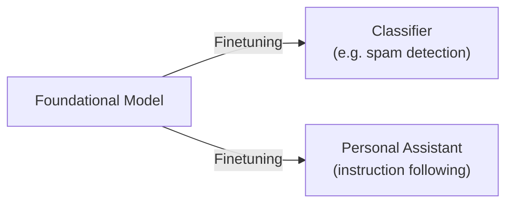

# LLM from Scratch 
 
A hands-on implementation of a Large Language Model built entirely from scratch — covering data preparation, transformer architecture, pretraining, and finetuning.
 
---
 
## Overview
 
This project walks through the full lifecycle of building an LLM, split into three progressive stages:
 

 
---
 
## Stages
 
### Stage 1 — Building an LLM
 
Implement the core components of a transformer-based LLM from the ground up.
 
| Module | Goal |
|--------|------|
| **Data Preparation & Sampling** | Implement data sampling and basic tokenization mechanisms |
| **Attention Mechanism** | Understand and build self-attention and multi-head attention |
| **LLM Architecture** | Assemble the full transformer model (embeddings, layers, output head) |
 
Code: [`stage1/`](./stage1)
 
---
 
### Stage 2 — Pretraining
 
Pretrain the LLM on unlabeled text data to build a general-purpose foundational model.
 
| Module | Goal |
|--------|------|
| **Training Loop** | Implement forward pass, loss computation, and backpropagation |
| **Model Evaluation** | Track perplexity and loss; validate model quality |
| **Load Pretrained Weights** | Bootstrap training using publicly available pretrained weights |
 
The output of this stage is a **Foundational Model** — a general LLM capable of next-token prediction.
 
---
 
### Stage 3 — Finetuning
 
Adapt the foundational model for specific downstream tasks.
 

 
| Variant | Description |
|---------|-------------|
| **Classifier** | Add a classification head and finetune on labeled data |
| **Personal Assistant** | Instruction-tune the model to follow human prompts |
 
---
 
## Project Structure
 
```
LLM_from_scratch/
├── stage1/
│   ├── data_preparation.ipynb     # Tokenization & sampling
│   ├── attention_mechanism.ipynb  # Self-attention implementation
│   └── llm_architecture.ipynb     # Full transformer architecture
├── stage2/                        # Coming soon
│   ├── training_loop.ipynb
│   ├── model_evaluation.ipynb
│   └── load_pretrained_weights.ipynb
├── stage3/                        # Coming soon
│   ├── classifier_finetune.ipynb
│   └── assistant_finetune.ipynb
└── README.md
```
 
---
 
## Getting Started
 
### Prerequisites
 
```bash
python >= 3.10
torch >= 2.0
```
 
### Installation
 
```bash
git clone https://github.com/dhyeyinf/LLM_from_scratch.git
cd LLM_from_scratch
pip install torch numpy matplotlib tiktoken
```
 
### Run Stage 1
 
Open any notebook in `stage1/` with Jupyter:
 
```bash
jupyter notebook stage1/
```
 
---
 
## Key Concepts Covered
 
- **Tokenization** — Byte-pair encoding (BPE), vocabulary construction
- **Embeddings** — Token + positional embeddings
- **Attention** — Scaled dot-product attention, causal masking, multi-head attention
- **Transformer blocks** — Layer norm, feed-forward layers, residual connections
- **Pretraining** — Next-token prediction, cross-entropy loss, learning rate scheduling
- **Finetuning** — Classification head, instruction tuning
---
 
## References
 
- [Attention Is All You Need](https://arxiv.org/abs/1706.03762) — Vaswani et al.
- [GPT-2 Paper](https://cdn.openai.com/better-language-models/language_models_are_unsupervised_multitask_learners.pdf) — Radford et al.
- *Build a Large Language Model (From Scratch)* — Sebastian Raschka
---
 
## License
 
MIT License — feel free to use, share, and build on this.
